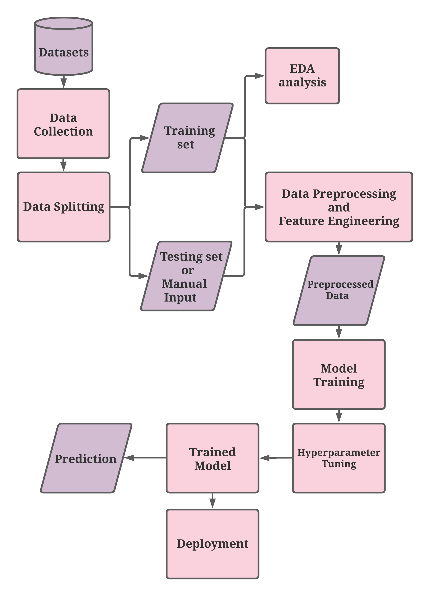

# Early Identification of Stroke : Project Overview🎯
## Problem statement
Stroke is sometimes termed as brain attack or a cardiovascular accident (CVA). It is much like a heart attack, only it occurs in the brain. 

It occurs when the supply of blood to the brain is reduced or blocked completely, which prevents brain tissue from getting oxygen and nutrients. 

According to the World Health Organization (WHO) stroke is the 2nd leading cause of death globally, responsible for approximately 11% of total deaths. 
Early identification of stroke can help doctors to give necessary medication to the patient.

## Machine Learning problem
Predict whether a patient is likely to get stroke based on the input parameters like gender, age, various diseases, and smoking status. 
<b>Type</b> : Supervised Learning 
<b>Task</b> : Binary classification 
<b>Performance metric</b> : F1 score (since imbalanced classes) 

## About Dataset
Source : https://www.kaggle.com/fedesoriano/stroke-prediction-dataset

### Attribute Information
<b>id</b>: unique identifier 
<b>gender</b>: Male, Female or Other 
<b>age</b>: age of the patient 
<b>hypertension</b>: 0 if the patient doesn't have hypertension, 1 if the patient has hypertension 
<b>heart_disease</b>: 0 if the patient doesn't have any heart diseases, 1 if the patient has a heart disease 
<b>ever_married</b>: No or Yes 
<b>work_type</b>: children, Govt_jov, Never_worked, Private or Self-employed 
<b>Residence_type</b>: Rural or Urban 
<b>avg_glucose_level</b>: average glucose level in blood 
<b>bmi</b>: body mass index 
<b>smoking_status</b>: formerly smoked, never smoked, smokes or Unknown 
<b>stroke</b>: 1 if the patient had a stroke or 0 if not (target) 

## Tools and Technologies used🛠
- Windows 10 OS 
- Python 3.7
- Pandas
- Numpy
- Malplotlib 
- Seaborn 
- Sklearn
- Flask
- HTML
- CSS
- BootStrap 
- Deployed on Heroku cloud

## Methodology

- Data Collection :- Different datasets from Kaggle were considered. Out of all the existing datasets, an appropriate dataset was selected for model building.
- Data Splitting :- The data is split into training and testing data for better accuracy and efficiency.
- EDA Analysis :- Performed Explanatory Data Analysis only on training set to avoid overfitting. Univariate as well as bivariate analysis is done.
- Data Preprocessing :- The feature and target variables are separated. Feature variables are further divided into numerical and categorical features. Also, filling missing data via *K-nearest neighbours imputation*.
- Feature Engineering :- Performed 3 tasks in it
1. Discretization :- For replacing the continuous values with a finite set of values.
2. OneHot Encoding :- For replacing categorical column(s) with the binary value for each category.
3. Feature Scaling :- For standardizing the numerical features.
- Model Training :- *Decision Tree Classifier* and *Logistic Regression* algorithm are used to build the model.
- Hyperparameter Tuning :- Used *RandomizedSearchCV* to tune the hyperparameters of both the models with f1 score as the evaluation metrics.
- Deployment - Used HTML and flask to develop a user-friendly page for the user to enter the input parameters and get the result.
**A web application to predict the chances of getting stroke by a patient based on other health factors like hypertension, Smoking habit, etc.**
- Live app :- https://brain-stroke-aditi-101803650.herokuapp.com/
- The model was trained and validated on 5100+ patient health records. 
- Achieved True Positive rate of 0.77 and F1 score of 0.24

## Novelty
